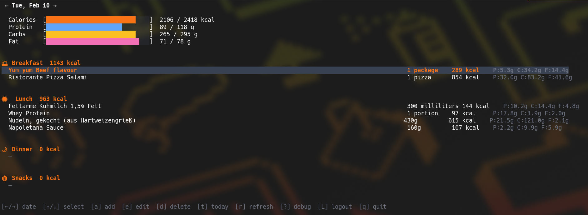

# yazio-cli (MOSTLY VIBE CODED, YOU HAVE BEEN WARNED!)

A terminal UI for [YAZIO](https://www.yazio.com/) built with [Bubble Tea](https://github.com/charmbracelet/bubbletea).

> **Note:** YAZIO has no official public API. This tool uses a reverse-engineered API that may break without notice.



## Features

- View your food diary with calorie and macro progress bars
- Navigate between days
- Add, edit, and delete food entries
- Search the YAZIO food database
- Token refresh via CLI flag (suitable for cron jobs)

## Install

```sh
go install github.com/koriwi/yazio-cli@latest
```

Or build from source:

```sh
git clone https://github.com/koriwi/yazio-cli
cd yazio-cli
go build -o yazio-cli .
```

## Usage

```sh
yazio-cli
```

On first launch you will be prompted to log in with your YAZIO email and password. Credentials are not stored — only the access and refresh tokens are saved locally.

### Token refresh

The access token expires after 48 hours. To refresh it without opening the TUI (e.g. from a cron job):

```sh
yazio-cli --refresh
```

## Keybindings

### Diary

| Key       | Action          |
| --------- | --------------- |
| `←` / `h` | Previous day    |
| `→` / `l` | Next day        |
| `↑` / `k` | Select up       |
| `↓` / `j` | Select down     |
| `a`       | Add meal        |
| `e`       | Edit selected   |
| `d`       | Delete selected |
| `t`       | Jump to today   |
| `r`       | Refresh         |
| `L`       | Logout          |
| `q`       | Quit            |
| `ctrl+c`  | Quit            |

## Config

Tokens are stored in `~/.config/yazio-cli/config.json` (XDG config dir).

## Feature ideas

- **Automatic token refresh** — on a `401` response, transparently exchange the stored refresh token for a new access token and retry the request, so the TUI never breaks after the 48-hour expiry.
